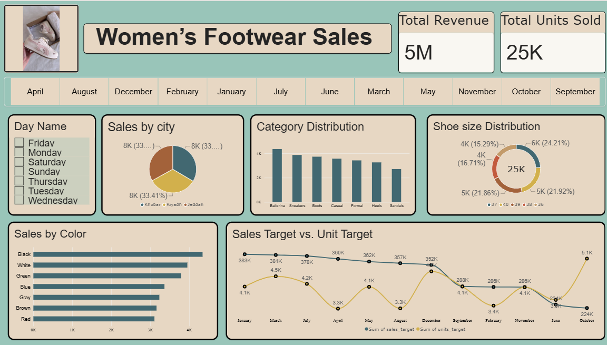

# 👟 Women's Footwear Sales Dashboard

<p align="center">
  
</p>

<p align="center">
  <b>Interactive Power BI Dashboard for Women's Footwear Sales Analysis</b>
</p>

---

## 📊 Project Overview

**Women's Footwear Sales Dashboard** is an interactive **Power BI dashboard** created from a single Women's Shoe Sales dataset.

The original dataset was organized into five logical tables — **Branches, Inventory, Sales, Sales Target, and Shoes** — to create a structured data model and develop an interactive sales dashboard.

The dashboard provides a visual overview of **revenue, units sold, city-wise sales, footwear categories, shoe sizes, colors, and target-related metrics**.

The project focuses on transforming a raw sales dataset into a clear and interactive **business intelligence dashboard** using Power BI.

---

## 🎯 Project Objectives

- 📌 Organize the original sales dataset into logical tables.
- 📈 Visualize overall sales performance.
- 💰 Track **Total Revenue**.
- 👟 Track **Total Units Sold**.
- 🌆 Analyze sales across different cities.
- 🏷️ Analyze sales across footwear categories.
- 🎨 Explore sales by shoe color.
- 📏 Analyze shoe-size distribution.
- 🎯 Compare sales and unit target metrics.
- 📅 Enable interactive analysis using month and day filters.

---

## 🗂️ Data Structure

The entire dashboard was created using **one original Women's Shoe Sales dataset**.

The dataset was organized into the following logical tables:

| Table | Description |
|---|---|
| 🏢 **Branches** | Contains branch and city-related information |
| 📦 **Inventory** | Contains inventory-related information |
| 💵 **Sales** | Contains sales-related information |
| 🎯 **Sales Target** | Contains target-related metrics |
| 👟 **Shoes** | Contains product attributes such as category, size, and color |

### 🔄 Data Flow

```text
Women's Shoe Sales Dataset
            │
            ▼
     Data Preparation
            │
            ▼
 ┌──────────┼──────────┬──────────────┬─────────────┐
 ▼          ▼          ▼              ▼             ▼
Branches  Inventory   Sales     Sales Target      Shoes
            │
            ▼
      Power BI Data Model
            │
            ▼
     Interactive Dashboard
```

---

## 📌 Dashboard Highlights

### 💰 Total Revenue

A KPI card displaying the overall revenue generated from the sales dataset.

### 👟 Total Units Sold

A KPI card showing the total quantity of footwear sold.

### 🌆 Sales by City

A visual comparison of sales performance across different cities/branches.

### 🏷️ Category Distribution

Shows the distribution of sales across different footwear categories:

- Ballerina
- Sneakers
- Boots
- Casual
- Formal
- Heels
- Sandals

### 📏 Shoe Size Distribution

Displays the distribution of sold footwear across different shoe sizes.

### 🎨 Sales by Color

Shows sales performance across different shoe colors:

- Black
- White
- Green
- Blue
- Gray
- Brown
- Red

### 🎯 Sales & Unit Target Performance

Provides a month-wise comparison of sales and unit target metrics.

### 📅 Interactive Filters

The dashboard includes interactive filters for:

- **Month**
- **Day Name**

These filters allow users to explore the dashboard according to different time periods.

---

## 📊 Dashboard Components

| Dashboard Component | Purpose |
|---|---|
| 💰 **Total Revenue** | Displays overall revenue |
| 👟 **Total Units Sold** | Displays total quantity of footwear sold |
| 🌆 **Sales by City** | Compares sales across cities |
| 🏷️ **Category Distribution** | Shows sales distribution across footwear categories |
| 📏 **Shoe Size Distribution** | Shows the distribution of sold shoe sizes |
| 🎨 **Sales by Color** | Compares sales across different shoe colors |
| 🎯 **Sales & Unit Target Performance** | Compares target-related metrics by month |
| 📅 **Month Filter** | Allows filtering by month |
| 📆 **Day Name Filter** | Allows filtering by day of the week |

---

## 🔍 Analysis Covered

The dashboard allows users to explore several aspects of the sales dataset:

- 💰 Overall revenue performance
- 👟 Total units sold
- 🌆 Sales performance across cities
- 🏷️ Sales distribution across footwear categories
- 📏 Distribution of sold shoe sizes
- 🎨 Sales performance by shoe color
- 🎯 Sales and unit target metrics
- 📅 Monthly sales and target performance
- 📆 Day-wise filtering of sales information

---

## 🛠️ Tools & Technologies

| Tool / Technology | Usage |
|---|---|
| 📊 **Microsoft Power BI** | Dashboard development and visualization |
| 🔄 **Power Query** | Data preparation and transformation |
| 🧮 **DAX** | Measures and calculations |
| 📁 **CSV / Excel Dataset** | Original data source |

---

## 📈 Skills Demonstrated

Through this project, the following skills were applied:

`Power BI`  
`Power Query`  
`DAX`  
`Data Preparation`  
`Data Transformation`  
`Data Modeling`  
`Data Visualization`  
`KPI Development`  
`Interactive Dashboards`  
`Sales Analysis`  
`Business Intelligence`

---

## 💡 Project Purpose

The purpose of this project was to create an interactive sales reporting dashboard from a single footwear sales dataset.

The original dataset was structured into multiple logical tables and then used within Power BI to create different analytical views.

The project demonstrates how raw sales data can be transformed into an interactive dashboard that makes business information easier to understand and explore.

---

## 📊 Dashboard Preview

The dashboard provides a single-page view containing:

- **Total Revenue**
- **Total Units Sold**
- **Month Filter**
- **Day Name Filter**
- **Sales by City**
- **Category Distribution**
- **Shoe Size Distribution**
- **Sales by Color**
- **Sales & Unit Target Performance**

---

## 📁 Repository Structure

```text
Women's-Footwear-Sales/
│
├── 📊 Women's Footwear Sales.pbix
├── 🖼️ dashboard.png
└── 📄 README.md
```

---

## 🚀 Project Outcome

The final Power BI dashboard transforms the original Women's Shoe Sales dataset into an interactive and visually organized reporting solution.

It provides a consolidated view of:

**Sales Performance → Product Analysis → City-wise Sales → Target Metrics**

The dashboard makes it easier to explore sales trends and product-level information through interactive visuals and filters.
